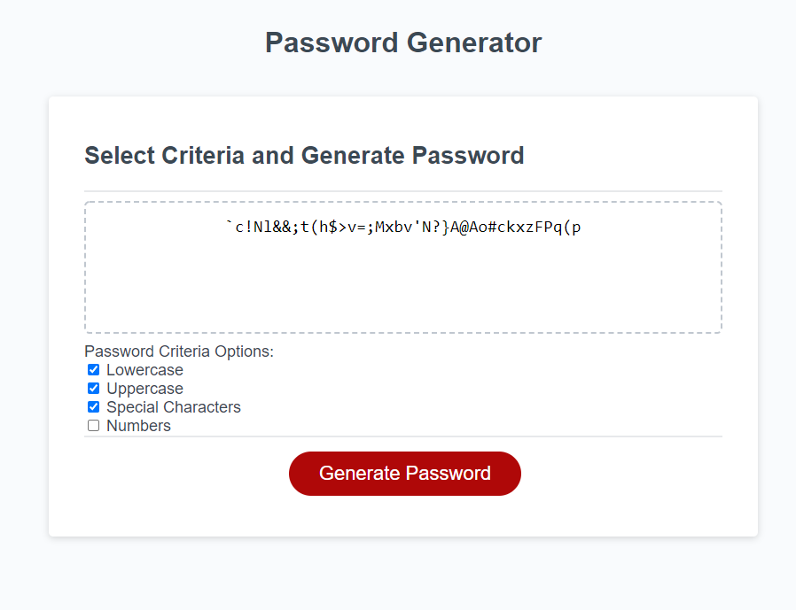

# Password-Generator
Web enabled Password Generator used within an organisation to generate secure passwords meeting the selected criteria

## Description
Employees with access to secure information are provided with access to the Password Generator, which is web-based.  The Password Generator allows employees to specify the length of the password and the relevant criteria to be applied in generating the password.  Passwords must be between 8 and 128 characters long.  Data validaition is used to ensure that the employees specifications are acceptable.  Once valid data has been entered by the employee, a password of the required lenght will be randomly generated from the selected criteria and presented to the employee.

## Usage
Upon accessing the web-site, and employee will be presented with four criteria that can be used in the generation of the password:  lowercase characters, uppercase characters, numbers and special characters (such as % and &).  Lowercase characters are selected by default.  Once the employee has checked the boxes of the criteria they wish to include, they click on the Generate Password button.  If the employee has not selected any criteria, an alert will be issued advising that the criteria must be selected.  If the criteria have been selected, then a prompt will be raised asking the employee to enter the desired length of the password (the default is 8).  Once the button has been pushed, the employee must enter a valid length - the process cannot be cancelled.  Once a valid length has been entered, the password will be generated and presented in the Password box in the centre of the screen.  The Password Generator can be used as many times as desired.

The webpage is located at this address:  https://cancer2806.github.io/Password-Generator/ and a screenshot of the webpage is provided below:

CSS is contained in one file:  ./assets/css/style.css
JS is contained in one file: ./assets/js/script.js

## Credits
Repository for the submission of Week 3's Homework in UWA's Bootcamp series

## License
Not applicable